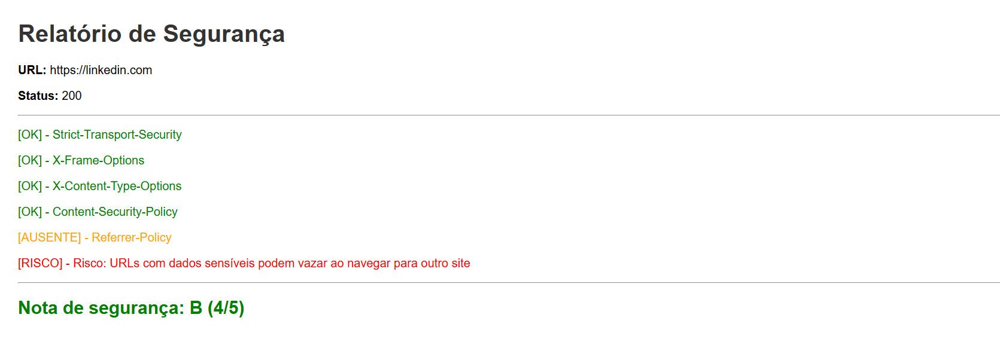
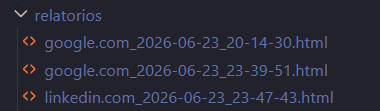

# HTTP Security Scanner

Scanner de segurança web em Python que analisa os headers HTTP de resposta de um site e identifica vulnerabilidades de configuração.

## Funcionalidades do Projeto

O script faz uma requisição HTTP para uma URL informada e verifica se os principais headers de segurança estão presentes na resposta do servidor. Cada header ausente representa uma vulnerabilidade real que pode ser explorada por atacantes.

## Importância

Muitos sites, inclusive grandes empresas, não configuram corretamente os headers de segurança HTTP. Essa falha abre brechas para ataques como:

- **Clickjacking**: quando `X-Frame-Options` está ausente
- **XSS (Cross-Site Scripting)**: quando `Content-Security-Policy` está ausente
- **Interceptação de conexão (MITM)**: quando `Strict-Transport-Security` está ausente
- **Vazamento de URLs sensíveis**: quando `Referrer-Policy` está ausente
- **Execução de arquivos maliciosos**: quando `X-Content-Type-Options` está ausente

## Headers verificados na requisição

| Header | O que protege |
|--------|--------------|
| `Strict-Transport-Security` | Garante que o navegador sempre use HTTPS, nunca HTTP puro |
| `X-Frame-Options` | Impede que o site seja carregado em iframe de outro site (clickjacking) |
| `X-Content-Type-Options` | Impede o navegador de adivinhar o tipo de um arquivo malicioso |
| `Content-Security-Policy` | Define de onde o site pode carregar recursos — defesa contra XSS |
| `Referrer-Policy` | Controla quanta informação é enviada ao navegar para outro site |

## Tecnologias utilizadas

- Python 3.13
- Biblioteca `requests`

## Como instalar e rodar

**1. Clone o repositório**
```bash
git clone [https://github.com/seu-usuario/http-security-scanner.git](https://github.com/PedroDGranato/HTTP-Security-Scanner-.git)](https://github.com/PedroDGranato/HTTP-Security-Scanner-)
cd http-security-scanner
```

**2. Instale as dependências**
```bash
pip install -r requirements.txt
```

**3. Rode o scanner**
```bash
python scanner.py
```

## Exemplos de saídas

# Linkedin 

```
Analisando: https://linkedin.com
Status: 200

   OK         Strict-Transport-Security
   OK         X-Frame-Options
   OK         X-Content-Type-Options
   OK         Content-Security-Policy
   AUSENTE    Referrer-Policy
```

# Netflix

```
Analisando: https://netflix.com
Status: 200

   OK         Strict-Transport-Security
   OK         X-Frame-Options
   OK         X-Content-Type-Options
   AUSENTE    Content-Security-Policy
   AUSENTE    Referrer-Policy
```
  
## Exemplos de saídas

O scanner gera um relatório HTML com cores para cada nota da url analisada:

- **Verde** — header presente e configurado
- **Laranja** — header ausente
- **Vermelho** — risco associado à ausência

**Linkedin (nota B):**


**Google (nota F):**


## Relatórios gerados
O scanner salva automaticamente um arquivo `.html` para cada análise na pasta `relatorios/`, com o nome no formato `dominio_data_hora.html`.



## Autor

Pedro Granato — graduado em ADS pelo IFSP, estudante de cibersegurança.  
[GitHub](https://github.com/PedroDGranato)  
